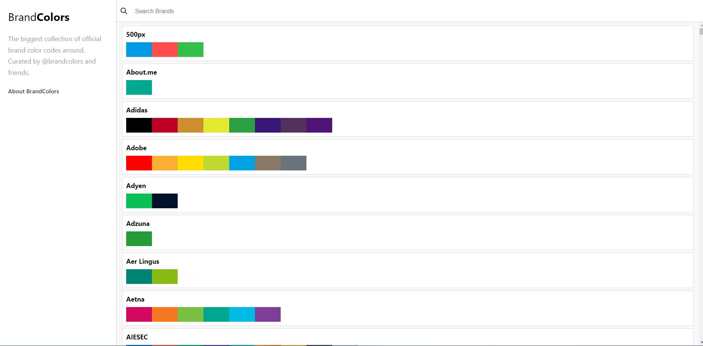
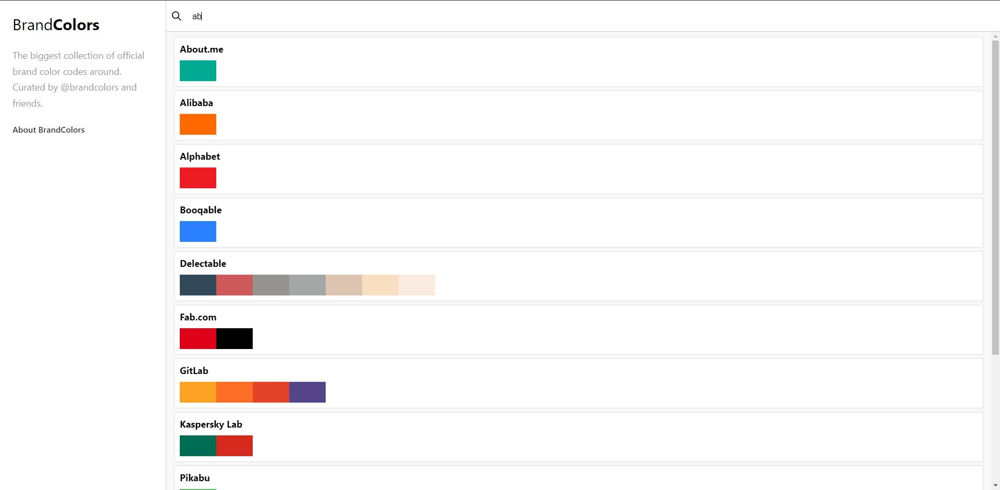
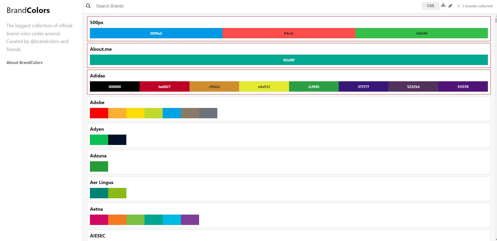

# React Brandcolors Clone
React JS - BrandColors Clone Project

## Table of contents
* [General info](#general-info)
* [Screenshots](#screenshots)
* [Projects](#Projects)
* [Code Examples](#code-examples)

## General info
Learning JavaScript libraries and frameworks can be overwhelming. There are many libraries to choose from, and no proper step-by-step guides that’ll teach you how to use these libraries to their fullest potential. That’s why, in this project, you’ll learn the most popular JavaScript library, used by hundreds of thousands of developers worldwide - React.js.

## Screenshots





## Projects
- React JS
- React Modul
- React Icons
- React Clipboard.js
- React Router Dom
- React Content Loader
- React Virtualized

## Code Examples
Show examples of usage:
```
  return (
    <>
      <MainContext.Provider value={data}>
        {copied && <Copied color={copied} />}
        <Sidebar />
        <BrowserRouter>
          <Routes>
            <Route path="/" element={<Content />}></Route>
            <Route path="/collection/:slugs" element={<Collection />}></Route>
          </Routes>
        </BrowserRouter>
      </MainContext.Provider>
    </>
  );
```
